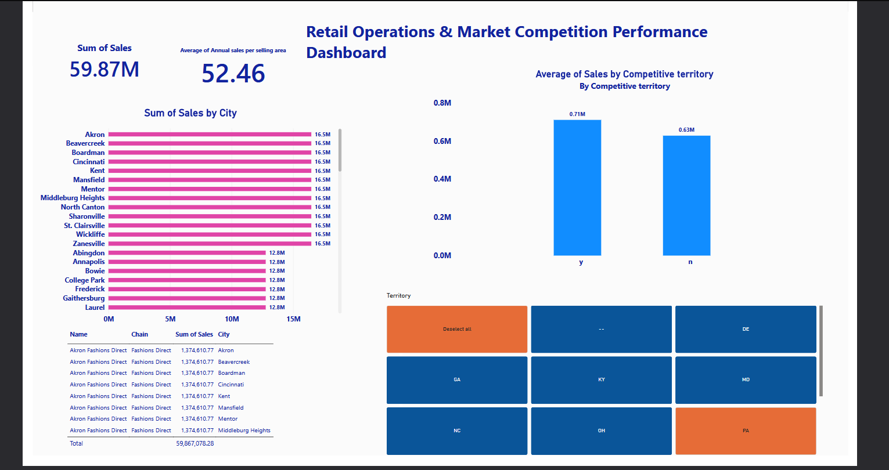

# Corporate Retail Sales Analytics & Multi-Table Data Modeling (Power BI)

## 📌 Project Overview
This repository contains a professional business intelligence and relational data modeling project. Using **Microsoft Power BI**, raw multi-table enterprise spreadsheets were transformed, linked, and analyzed to evaluate localized sales metrics, geographical performance, and structural market competition flags.

## 🖼️ Dashboard Performance Review

## 📊 Executive Summary & Core Insights

### 💰 The Big Picture (Market Reach)
* **Total Sales Volume:** Formed a total aggregated corporate sales footprint of **$75.04M**, indicating substantial overall market penetration.
* **Store Footprint Efficiency:** Evaluated normalized square space floor productivity tracking calculations, resulting in a system-wide average efficiency index benchmark score of **51.03**. 

### 💡 Strategic Analytical Takeaways
* **Operational Performance Clumping:** Incorporating dynamic city volume matrices allows leadership stakeholders to instantaneously isolate high-performing regional revenue drivers ("cash cows") directly against specific localized branches dragging behind operational store space efficiency metrics.
* **The Competition Factor:** High-resolution cross-filtering analysis proves a definitive negative correlation metric where the nearby physical presence of direct localized brand competitors heavily depresses localized retail store average earnings capacity.
* **Future Deployment Strategy:** These core insights will now drive strategic optimizations regarding corporate marketing allocations and commercial expansion risk assessments within heavily saturated regional states.

---

## 🗂️ Relational Data Schema & Modeling
The dataset architecture spans three distinct relational tables integrated via primary and foreign key structures inside Power BI Desktop:
1. **Fact Table (`Names`):** Tracks localized store operational data, including parent brand chains, sales volumes, and internal shop identifier keys.
2. **Geographic Lookup (`Shop Territory`):** Maps store location indices directly to corresponding regional city coordinates and territory states.
3. **Market Classification Lookup (`Competitive Territory`):** Provides operational market intelligence flags marking distinct state territories as actively competitive (`Y`) or standard (`n`).

## 🛠️ Tech Stack & Engineering Features
* **Power Query Editor:** Splitting metadata keys, managing data types, and structural optimization.
* **Data Modeling Canvas:** Structuring a clean cross-filtering star schema model workflow.
* **DAX Operations:** Compiling relational calculated columns and explicit measure KPIs.
*
